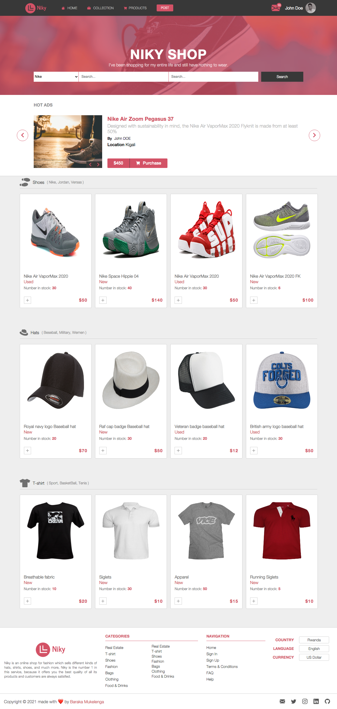

# Niky

> Niky is an online shop for fashion which sells different kinds of hats, shirts, shoes, and much more, Niky is the number 1 in this service, because it offers you the best quality of all its products and customers are always satisfied.

This website was designed with the tools below:

## Built With

- HTML
- CSS Grid
- CSS Flexbox
- SASS

## Live Demo

[Visit the website](https://niky.netlify.app)

## Getting Started

**If you want to know more about how this website was designed, you can just copy the link of the repository and clone it into your local computer. then open the folder in your preferred editor. Open the index.html file with chrome or the live server extension if you are using VScode.**

To track all the linter errors you can run the following command at the root of your project if you have NPM installed on your computer.

### Install

`npm install`

## Author

👤 **Barack Mukelenga**

- GitHub: [@barackm](https://github.com/barackm)
- Twitter: [@BarackMukelenga](https://twitter.com/BarackMukelenga)
- LinkedIn: [Baraka Mukelenga](https://www.linkedin.com/in/baraka-mukelenga/)

## 🤝 Contributing

Contributions, issues, and feature requests are welcome!

Feel free to check the [issues page](https://github.com/barackm/Niky/issues).

## Show your support

Give a ⭐️ if you like this project!❤️❤️❤️

## Acknowledgments

- [Mohammed Awad on Behance](https://www.behance.net/M_Awad)
